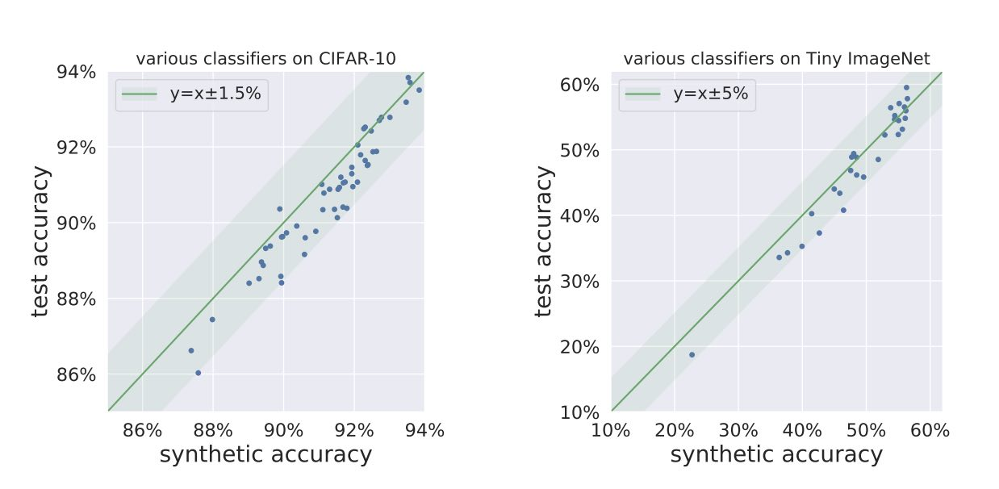

A central problem of generalization theory is the following: *Given a training dataset and a deep net trained with that dataset, give a mathematical estimate of the test error.* 

While this may seem useless to a practitioner ("why not just retain some holdout data for testing?"), this is of great interest to theorists trying to understand what properties of the net or the training algorithm lead to good generalization. Old posts on this blog such as [this one](http://www.offconvex.org/2018/02/17/generalization2/) mentioned the difficulties in applying classic generalization theory to get estimates of generalization error even within a few orders of magnitude.

This blog post is about the topic of a 
 NeurIPS 20 competition [Predicting Generalization in Deep Learning competition](https://sites.google.com/view/pgdl2020) which suggested using machine learning techniques to  understand network properties that promote generalization! Contestants are given datasets and a set of deep nets trained on these datasets using unknown techniques. The goal is to rank the trained nets according to generalization error. Contestants provide a python code that, given a training set and a trained net, outputs a scalar estimate of the generalization error. The contestant's performance is computed using a ranking measure of how well their scalar score correlates with actual generalization. 
 Several interesting ideas emerged from the competition, such as measuring networks' resilience to distortions to the input; collecting specific statistics of hidden node activations; and measuring output consistency of identically structured networks but trained by SGD with different random seeds. 

 
 This blog post describes our [ICLR22 spotlight paper](https://arxiv.org/abs/2111.14212), coauthored with Nikunj Saunshi and Arushi Gupta, that gives a surprisingly easy method to predict generalization using [Generative Adversarial Nets](http://www.offconvex.org/2017/03/15/GANs/) or GANs.  
 

## Predicting Generalization using GANs
Given a training dataset and a collection of nets trained using it, our method is very simple:

>**Step 1)** Train a Generative Adversarial Network (GAN) on the same training dataset a
>
>**Step 2)** Draw samples from the GAN generator to obtain a synthetic dataset.
>
>**Step 3)** For each classifier in the task, use its classification error on the synthetic data as our prediction for its true test error 

We find for a variety of image datasets that using pre-trained Studio-GANs directly downloaded from [public repositories](https://github.com/POSTECH-CVLab/PyTorch-StudioGAN), we obtain scores that would ''not only outperforms other methods but blows them out of the water'' (to cite one of the reviews for our paper), including the winning methods proposed at the PGDL competition (see Table 1 in the paper for quantitative results). Here we show plots of true test errors v.s. errors on the synthetic data, where we generate one synthetic dataset from a GAN trained on each dataset, and each dot in the figures represents a trained deep net classifier.

   

Not only is the correlation linear; it appears remarkably close to the $y=x$ fit! Also the trained deep net classifiers here belong to drastically different architecture families ---including VGG, ResNet, DenseNet, ShuffleNet, PNASNet, and MobileNet--- which don't correspond to the discriminator of Studio-GAN. 

Frankly, this success at predicting generalization confounded the authors, some of whom had earlier shown that GANs [do not learn the distribution well, and suffer from serious mode collapse](http://www.offconvex.org/2017/07/06/GANs3/)).

Thus we conclude following three statements all appear to be true: 
 

> **Observation 1)** GAN samples suffer from mode collapse (as detected by the [birthday paradox test](http://www.offconvex.org/2017/07/06/GANs3/) and do not appear to be as diverse as the distribution of images the GANs was trained on.  

> **Observation 2)** Training deep net classifiers using only GAN samples leads to poor performance. This is another evidence that GAN samples are poor substitutes for the real thing. 

> **Observation 3)** Yet GAN samples are good enough to substitute for holdout data in giving a reasonable prediction of test performance.

 Note however that there is no inherent contradiction here. For instance, suppose the GAN's distribution has limited diversity: it only knows how to generate a $10,000$  random images, as well as $1000$ minor variations of each of these images. So long as the  $10,000$ distinct images are like random draws from the full distribution, it could  predict generalization for a trained net reasonably well, even though a million image samples from the GAN would not suffice to replace ImageNet's 1 million images for training a deep net from scratch. 

We hope our work initiates a quest for investigations what GANs can generate and for better utilizing GAN samples.

(Aside: Of course, the field has now progressed beyond simple GANs to multimodal generators like [DALL-E](https://openai.com/blog/dall-e/), and it would be interesting to understand how the generated images there can be leveraged to predict generalization.)

